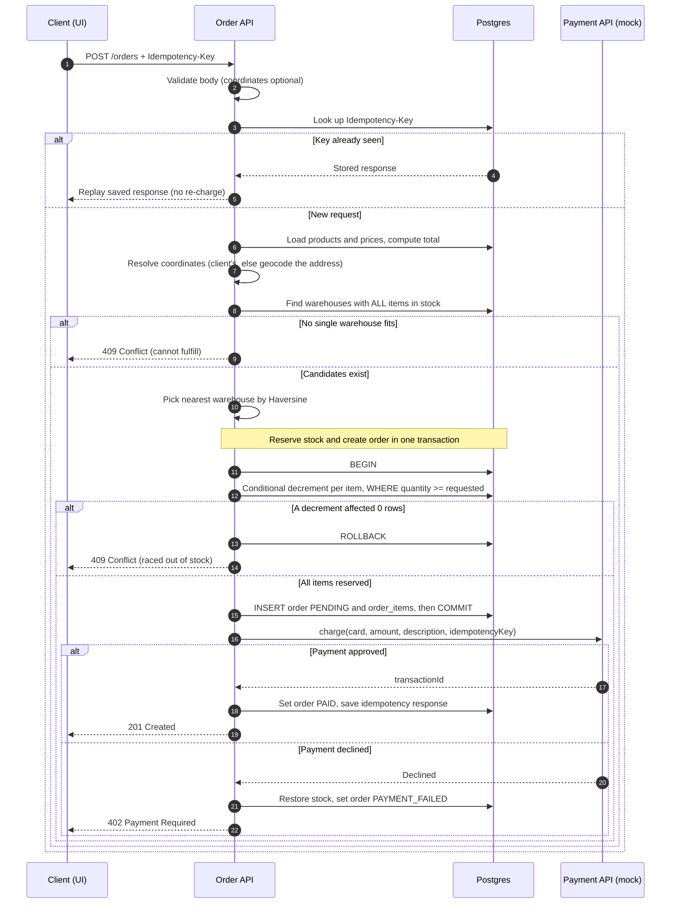

# Order Management Service — Design Document

> Backend take-home for Canals: a production-shaped order-management API.
> This document records the design and the rationale behind the key decisions.
> §11 lists the resolved choices.

---

## 1. Problem statement

Build a backend web service exposing `POST /orders`, called by a storefront UI when a
customer places an order. Creating an order must:

1. Accept a customer, a shipping address, and a list of `{product, quantity}` items.
2. Find **one** warehouse that can fill the **entire** order (every product, in sufficient quantity).
3. If multiple warehouses qualify, choose the one **closest** to the shipping address.
4. Charge an **external payment API** (mocked) with card number, amount, description.
5. Persist the order durably.

The design prioritizes production rigor: correct behavior under concurrent load, sane
failure handling, and clean data storage.

---

## 2. Goals & non-goals

### Goals
- A correct, production-shaped `POST /orders` backed by a real database (Postgres).
- Correct inventory behavior under **concurrency** (no overselling the last unit).
- Sane handling of the **external payment** step (no charging for an order we can't fill;
  no overselling after a charge).
- Clean separation of domain logic from I/O (DB, payment) so integrations are swappable
  and the code is easy to extend.

### Non-goals (out of scope, per the brief)
- Auth / authn / authz.
- CRUD APIs for customers, warehouses, products, inventory (assumed to exist / seeded).
- Real payments — **mocked** behind an interface.
- Real geocoding — **mocked** behind a `Geocoder` port (see §6.6).
- A UI.
- Automated tests are optional. A thin layer of high-value tests covers the inventory
  decrement and the order use-case; exhaustive coverage is skipped.

---

## 3. API specification

### `POST /orders`

**Request body**
```json
{
  "customerId": "uuid",
  "shippingAddress": {
    "line1": "123 Main St",
    "city": "Bogotá",
    "region": "Cundinamarca",
    "postalCode": "110111",
    "country": "CO",
    "latitude": 4.7110,
    "longitude": -74.0721
  },
  "items": [
    { "productId": "uuid", "quantity": 2 },
    { "productId": "uuid", "quantity": 1 }
  ],
  "payment": { "cardNumber": "4111111111111111" }
}
```
- `latitude`/`longitude` are **optional** (sent as a pair); omitted → geocoded server-side (see §6.6).
- `Idempotency-Key: <uuid>` header (see §6.5).

**Success — `201 Created`**
```json
{
  "id": "uuid",
  "status": "PAID",
  "customerId": "uuid",
  "warehouseId": "uuid",
  "items": [{ "productId": "uuid", "quantity": 2, "unitPrice": 1999 }],
  "totalAmount": 5997,
  "currency": "USD",
  "paymentTransactionId": "mock_txn_...",
  "createdAt": "2026-06-22T..."
}
```

**Error responses** (problem-style JSON: `{ "error": { "code", "message", "details" } }`)

| Status | When |
|--------|------|
| `400 Bad Request` | Malformed body, lone coordinate (lat/lng must be paired), unknown product or customer, non-positive quantity |
| `402 Payment Required` | Payment API declined the charge |
| `409 Conflict` | No single warehouse can fill the whole order (insufficient stock) |
| `500` | Unexpected server error |
| `503 Service Unavailable` | Payment provider unreachable after retries |

> Money is stored/sent as **integer minor units** (cents), never floats. Products carry a
> `price` so the **server** computes the charge amount; the client is never trusted for money
> (the brief gives the payment API an "amount" but no price source — see §4).

---

## 4. Data model

Postgres. UUID primary keys. `created_at`/`updated_at` timestamps everywhere.

```
warehouses
  id            uuid pk
  name          text
  latitude      double precision
  longitude     double precision

products
  id            uuid pk
  sku           text unique
  name          text
  price         integer      -- minor units (cents); source of truth for charge amount

inventory
  warehouse_id  uuid  fk -> warehouses
  product_id    uuid  fk -> products
  quantity      integer  check (quantity >= 0)
  primary key (warehouse_id, product_id)

customers
  id            uuid pk
  name          text
  email         text

orders
  id                     uuid pk
  customer_id            uuid fk -> customers
  warehouse_id           uuid fk -> warehouses
  status                 order_status   -- PENDING | PAID | PAYMENT_FAILED | CANCELLED
  ship_line1, ship_city, ship_region, ship_postal_code, ship_country  text
  ship_latitude          double precision   -- client-provided or geocoded (see §6.6)
  ship_longitude         double precision
  total_amount           integer
  currency               text default 'USD'
  payment_transaction_id text null
  idempotency_key        text null
  created_at, updated_at timestamptz

order_items
  id            uuid pk
  order_id      uuid fk -> orders
  product_id    uuid fk -> products
  quantity      integer check (quantity > 0)
  unit_price    integer   -- snapshotted price at order time (don't trust product.price later)

idempotency_keys
  key                 text pk
  request_fingerprint text          -- hash of (route + body) to detect key reuse with a different payload
  response_status     integer null
  response_body       jsonb null
  created_at          timestamptz
```

Seed data (seed script): a handful of warehouses in different cities with
overlapping-but-not-identical inventory, plus products and customers, so the
"closest warehouse that has everything" logic is actually exercised.

**Customer modeling:** FK to a seeded `customers` table — the customer is assumed to be
already **registered** (no customer-management API, per the brief).

---

## 5. Order creation flow

`POST /orders` follows a **reserve → charge → confirm** shape, with compensation on payment
failure:

1. Validate the body (shipping coordinates optional, but lat/lng must be sent as a pair).
2. Idempotency: if the `Idempotency-Key` was already seen, return the stored response.
3. Load products and prices; compute the line items and total amount.
4. Resolve the destination coordinates (client-supplied, or geocode the address when omitted),
   then select a warehouse: candidates stock every item in sufficient quantity; pick the one
   nearest those coordinates (Haversine). None → `409`.
5. In one transaction: atomically decrement the chosen warehouse's stock for each item and
   create the order as `PENDING`. A decrement that loses the race rolls the whole
   transaction back (retry selection once, else `409`). No external I/O inside the transaction.
6. Charge the payment API **outside** the transaction. Success → `PAID`. Decline → restore
   the reserved stock and mark `PAYMENT_FAILED` (`402`).
7. Store the idempotency response and return `201`.



---

## 6. Key design decisions (rationale)

### 6.1 Inventory decrement & concurrency
The main concurrency concern is two orders racing for the last unit of stock.

**Approach — atomic conditional decrement inside a transaction.** For each item:
```sql
UPDATE inventory
   SET quantity = quantity - $qty
 WHERE warehouse_id = $w AND product_id = $p AND quantity >= $qty
RETURNING quantity;
```
If any item affects 0 rows, the warehouse can't fill it → roll back the whole transaction
(no partial decrements). The `quantity >= $qty` guard plus the row lock Postgres takes during
`UPDATE` makes this race-free without holding explicit locks longer than needed. Overselling
is impossible (`check (quantity >= 0)` is a backstop).

In Prisma this is a single `inventory.updateMany({ where: { …, quantity: { gte } },
data: { quantity: { decrement } } })` whose returned `count` indicates whether the row was updated.

**Alternative — `SELECT … FOR UPDATE` then decrement.** Needed only for a read-decide-then-write;
the conditional update does it atomically in one step, so it holds locks for less time. (Prisma
would need `$queryRaw` for `FOR UPDATE`, which this approach avoids.)

**Rejected — optimistic versioning / app-level checks:** more moving parts, worse under
contention for this hot path.

### 6.2 Payment ↔ inventory consistency
**Approach — reserve, then charge, then confirm (a small saga).**
1. Txn A: decrement inventory + create `PENDING` order. Commit.
2. Call payment **outside** any open transaction.
3. On success → `PAID`. On decline → compensate (restore stock) + `PAYMENT_FAILED`.

The key constraint: **do not hold DB row locks across an external network call** — at high
traffic that turns payment latency into lock contention and tanks throughput. Reserving first
also guarantees a card is never charged for an order that then can't be filled.

**Known failure window:** if the process dies between charge-success and writing `PAID`, the
order is left `PENDING` with a real charge. Mitigated by an idempotent (keyed) payment call;
a reconciliation sweep (§10) would resolve stuck `PENDING` orders.

**Rejected — charge first then reserve** (can charge for an unfulfillable order) and
**one transaction spanning the payment call** (lock-holding anti-pattern).

### 6.3 Closest-warehouse distance
**Approach — Haversine in application code** over the (few) candidate warehouses that already
passed the stock filter. Simple, dependency-free, correct. **Scale path:** for many warehouses,
push to Postgres with `earthdistance`/`cube` or PostGIS `geography` + a GiST index and
`ORDER BY distance LIMIT 1`; noted for completeness, overkill at this size.

### 6.4 Mocked payment integration (behind an interface)
`PaymentGateway.charge({cardNumber, amount, description, idempotencyKey}) -> {status, transactionId}`
— approves by default; a configurable rule (e.g. a magic card number / amount) forces a decline
so the compensation path is exercisable. Injected via constructor (ports & adapters), so a real
provider can be swapped in later.

### 6.5 Idempotency
`POST /orders` is not naturally idempotent, but a retried order (network blip, double-click)
must not double-charge or double-decrement. **Approach — `Idempotency-Key` header:** the first
request stores key + response; retries with the same key return the stored response without
re-processing. The same key is forwarded to the payment mock so the charge is idempotent too.
In scope for the initial build.

### 6.6 Address coordinates: client-supplied, geocoded when absent
`latitude`/`longitude` are an **optional** input, sent as a pair (a lone value is rejected with a
`400`). When supplied they are used directly; when omitted, the address is geocoded via a `Geocoder`
port.

Client-supplied coordinates are preferred: the client resolves the address (autocomplete, a
confirmed map pin), so they are authoritative and avoid the wrong-warehouse selection an inaccurate
string→coordinate guess can cause — costly to unwind downstream (wrong fulfillment, failed delivery),
and most acute where free-text addresses geocode poorly. Server-side geocoding covers callers that
have only an address.

---

## 7. Tech stack

| Concern | Choice | Notes |
|--------|--------|-------|
| Language | TypeScript on Node 22 | Matches Canals (Node/TS) |
| HTTP framework | Fastify | Built-in JSON-schema validation + pino logging, less boilerplate |
| DB | Postgres 16 (docker-compose) | Real transactions + row locking — needed for §6.1 |
| DB access | Prisma + Prisma Migrate | Schema-first & readable; handles the atomic decrement via `updateMany`. `FOR UPDATE` (not needed here) would use `$queryRaw` |
| Validation | Fastify JSON Schema (Ajv) | body validation + lat/lng pairing live here |
| Config | env vars (dotenv) | |
| Logging | pino (Fastify default) | structured logs |
| Container | docker-compose for Postgres | one-command local bring-up |

---

## 8. Project structure (ports & adapters, lightweight)

```
src/
  domain/             # entities, value objects, domain errors (no I/O)
    order.ts
    errors.ts
  application/         # use-cases orchestrating domain + ports
    create-order.ts
    ports.ts          # PaymentGateway, repositories (interfaces)
  infrastructure/
    db/
      client.ts        # Prisma client
      order-repository.ts
      inventory-repository.ts
    payment/
      mock-payment-gateway.ts
  http/
    server.ts
    routes/orders.ts
    error-mapper.ts    # domain error -> HTTP status
  config.ts
prisma/
  schema.prisma        # data model + migrations source of truth
  seed.ts              # warehouses, products, inventory, customers
docker-compose.yml
README.md
PRD.md
```

The use-case (`create-order.ts`) depends only on the port interfaces; the DB, payment, and
geocoder adapters implement them.

---

## 9. Running it locally
```
docker compose up -d        # Postgres
npm install
npx prisma migrate dev      # apply migrations
npx prisma db seed          # warehouses, products, inventory, customers
npm run dev                 # start the server
# then: curl -X POST localhost:3000/orders ...
```
The README includes ready-to-run `curl` examples: happy path, no-warehouse (409), payment
decline (402), and idempotent retry (same key → same response, no second charge).

---

## 10. Production considerations / future work (documented, not all built)
- **Reconciliation sweeper** for orders stuck `PENDING` after a crash mid-charge.
- **Outbox / event** on order paid (notify fulfillment) — out of scope here.
- **Rate limiting & backpressure** on the endpoint.
- **Observability**: request IDs, metrics on fulfillment rate / payment decline rate.
- **Geospatial index** (PostGIS) when warehouse count grows (§6.3).
- **Inventory reservations table** (with TTL) instead of in-place decrement, if stock must be
  held before payment with auto-expiry — the current approach reserves by decrementing.

---

## 11. Appendix — scaling to microservices

Split into Order, Inventory, and Payment services (database-per-service), the single ACID
transaction is no longer available, so the same **reserve → charge → confirm** becomes an
**orchestrated saga**: each step is a local transaction with a compensating action (release the
reservation, mark the order failed) when a later step fails. Supporting pieces: a **transactional
outbox** to publish events reliably alongside each local commit (the dual-write problem),
**idempotent consumers** for at-least-once delivery, and **inventory reservations with TTL** so a
dead saga auto-releases stock. Two-phase commit is avoided — it's blocking, hurts availability,
and scales poorly, which is why sagas are the norm. This trades ACID for eventual consistency and
real operational cost, so it's worth doing only once scale or team boundaries require it; the
monolith above gets the same correctness from one transaction and a single compensating call.

---

## 12. Resolved decisions
1. **Framework:** Fastify.
2. **DB access:** Prisma + Prisma Migrate (atomic decrement via `updateMany`; `$queryRaw` only
   if a future feature needs `FOR UPDATE`).
3. **Idempotency:** in scope for the initial build.
4. **Customer modeling:** FK to seeded `customers`; the customer is assumed registered.
5. **Product pricing:** products carry `price`; the server computes the charge amount.
6. **Address coordinates:** client-provided when available (preferred); geocoded via a mock `Geocoder` port when omitted (§6.6).
